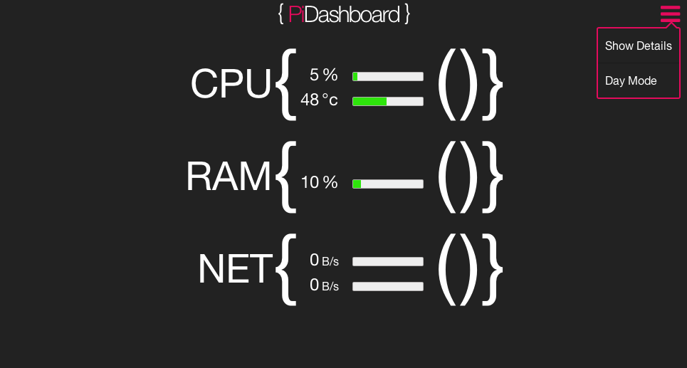

PiDashboard
===========

A web front end to show statistics of Raspberry Pi CPU, RAM and Network usage along with some other useful things like current time and weather and whatever else I think of adding. 
Things to be added are disk usage for all mounted disks, some controls to start/stop programs like samba and responsive design.

Requirements
============
PiDashboard requires Apache2 and php5 packages to function.
